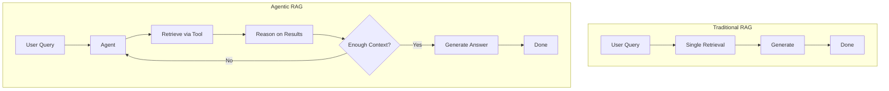

# Introduction to Agentic RAG

In traditional RAG, retrieval happens once at the beginning. The user asks a question, the system retrieves relevant documents, the model generates a response, and you're done. But what if the first retrieval isn't enough? What if the system needs to dig deeper—or search again based on what it learned? That's **Agentic RAG**. In Agentic RAG, an **agent** controls the retrieval process. It decides when to search, what to search for, and can search multiple times, refining its queries from intermediate results. The system is no longer a passive consumer of one shot of retrieved information; it becomes an active researcher. This document explains what Agentic RAG is, how it differs from traditional RAG, how it works, and why it matters for areas like cybersecurity.

## Definition

**Agentic RAG** (Agentic Retrieval-Augmented Generation) combines **autonomous AI agents** with RAG. Instead of a fixed, linear pipeline (query → retrieve once → generate), the agent **plans**, **decides**, and **acts** over multiple steps: it can retrieve, reason on what it found, decide to search again with a new or refined query, and only then generate a final answer when it has enough context.

Key terms:

- **Traditional (classic) RAG**: Single-pass pipeline—embed query, retrieve top-k documents once, generate. No planning or iterative retrieval.
- **Agentic RAG**: Control-loop style—retrieve → reason → decide → retrieve again or generate. The agent has **tools** (e.g. search, database, API) and chooses when and how to use them.
- **Multi-step retrieval**: Multiple retrieval rounds, each possibly with different queries or data sources, informed by previous results.
- **Tool use**: The agent can call search tools, query databases, or hit APIs; retrieval is not limited to one vector store call.

Agentic RAG systems often use **reflection** (e.g. grading retrieved docs), **query rewriting**, and **hallucination checks** so that poor initial retrieval can be corrected instead of leading to a wrong answer.

## How it works

Traditional RAG is a **pipeline**: one retrieval, then generation. Agentic RAG is a **control loop**. A typical pattern is:

1. **Retrieve** — Get relevant context (e.g. from a vector store, API, or database using a tool).
2. **Reason** — The agent evaluates the context: Is it enough? Is it relevant? What’s missing?
3. **Decide** — Search again with a new or refined query, call another tool, or stop and generate.
4. **Repeat or generate** — Loop until the agent is satisfied, then produce the final answer.

The agent is given **tools** (e.g. a search tool, a database query tool, an API tool). It decides *which* tool to use and *when*. That makes the system more complex than basic RAG but also far more capable for questions that need multi-step reasoning or multiple data sources.

Implementations often include **state** (e.g. conversation history, accumulated retrievals) and optional nodes such as a **grader** (relevance of retrieved docs), **query rewriter** (refine the search query), and **hallucination checker** (ensure the answer is grounded in retrieved content). Frameworks like LangGraph model this as a cyclic graph over these steps rather than a straight chain.

## Use cases and examples

Agentic RAG shines when the task is **non-linear**: when one retrieval is not enough and the next search depends on what was just found.

**Example: Security incident investigation**

Imagine an agent investigating a security incident. It might start by retrieving information about the initial alert. From that, it learns the alert involves a specific IP address. So it retrieves threat intelligence about that IP. It discovers the IP is tied to a known malware family. So it retrieves documentation about that malware. Each retrieval informs the next. The agent follows leads, can go down “rabbit holes,” and builds a fuller picture—the way a human analyst would, but automated.

**Other use cases**

- **Threat detection and classification** — Mapping events to frameworks (e.g. MITRE ATT&CK), classifying attack types, with iterative retrieval and reasoning.
- **SOC triage and investigation** — Agents with tools for summarization, observable extraction (IPs, hostnames), and multi-step investigation.
- **Complex Q&A over many sources** — When the answer requires combining documents, APIs, and databases in a sequence the agent discovers at runtime.
- **Research and due diligence** — Following chains of references or evidence across multiple retrievals.

For cybersecurity, this is especially relevant: investigations are rarely linear. You need systems that can **explore** and **adapt** their research based on what they find, rather than a single query–response step.

## Summary

| Aspect | Traditional RAG | Agentic RAG |
|--------|------------------|-------------|
| Retrieval | Once, at the start | Multiple times; agent decides when and what |
| Flow | Pipeline (retrieve → generate) | Control loop (retrieve → reason → decide → repeat or generate) |
| Tools | Typically one retriever | Search, DB, API tools; agent chooses |
| Best for | Focused, single-shot questions | Multi-step reasoning, investigations, exploration |

Implementing Agentic RAG means giving your agent **tools** and a **loop**: the agent decides which tool to use and when, and can refine its strategy from intermediate results. It is more complex than basic RAG but far more powerful for tasks that require adaptive, multi-step retrieval—such as security incident investigation.

## References / Further reading

-- **[Defending and Deploying AI](https://www.oreilly.com/videos/defending-and-deploying/9780135463727/) (video)**  This course provides a comprehensive, hands-on journey into modern AI applications for technology and security professionals, covering AI-enabled programming, networking, and cybersecurity to help learners master AI tools for dynamic information retrieval, automation, and operational efficiency. It dives deeply into securing generative AI, addressing critical topics such as LLM security, prompt injection risks, and red-teaming AI models. Participants also learn how to build secure, cost-effective AI labs at home or in the cloud, with practical guidance on hardware and software choices. Finally, the course explores AI agents and agentic RAG for cybersecurity, demonstrating how large language models can be applied to both offensive and defensive operations through real-world examples and hands-on labs. 

- **[AI-Enabled Programming, Networking, and Cybersecurity](https://learning.oreilly.com/course/ai-enabled-programming-networking/9780135402696/)**
Learn to use AI for cybersecurity, networking, and programming tasks.
Use examples of practical, hands-on activities and demos that emphasize real-world tasks.
Implement AI tools as a programmer, developer, networking, or security professional.

- **[Securing Generative AI](https://learning.oreilly.com/course/securing-generative-ai/9780135401804/)**
Explore security for deploying and developing AI applications, RAG, agents, and other AI implementations
Learn hands-on with practical skills of real-life AI and machine learning cases
Incorporate security at every stage of AI development, deployment, and operation

- [Agentic Retrieval-Augmented Generation: A Survey](https://arxiv.org/abs/2501.09136) – arXiv
- [What is Agentic RAG? Complete Guide to AI Agents + RAG](https://www.articsledge.com/post/agentic-retrieval-augmented-generation-rag) – Articsledge
- [What Is Agentic RAG: Next-Gen AI Retrieval](https://www.progress.com/blogs/what-is-agentic-rag) – Progress
- [What is Agentic RAG?](https://www.ibm.com/think/topics/agentic-rag) – IBM
- [Agentic RAG: How It Works, Use Cases, Comparison With RAG](https://www.datacamp.com/blog/agentic-rag) – DataCamp
- [Agentic RAG vs. Traditional RAG](https://medium.com/@gaddam.rahul.kumar/agentic-rag-vs-traditional-rag-b1a156f72167) – Medium
- [Agentic RAG vs Classic RAG: From a Pipeline to a Control Loop](https://towardsdatascience.com/agentic-rag-vs-classic-rag-from-a-pipeline-to-a-control-loop/) – Towards Data Science
- [Agentic RAG](https://docs.langchain.com/oss/python/langgraph/langgraph-agentic-rag) – LangChain/LangGraph
- [Building Agentic RAG Systems with LangGraph](https://rahulkolekar.com/building-agentic-rag-systems-with-langgraph/) – Rahul Kolekar
- [RAG and Agentic AI: Revolutionizing cybersecurity analysis](https://businessprocessincubator.com/content/rag-and-agentic-ai-revolutionizing-cybersecurity-analysis) – Business Process Incubator
- [CyberRAG: An Agentic RAG cyber attack classification and reporting tool](https://ui.adsabs.harvard.edu/abs/2025arXiv250702424B/abstract) – ADS
- [Cisco XDR Agentic AI](https://blogs.cisco.com/security/cisco-xdr-agentic-ai-with-ciscos-foundational-ai-model) – Cisco Security Blogs
