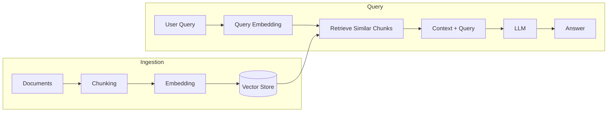

# Retrieval-Augmented Generation (RAG)

Retrieval-augmented generation (RAG) is a technique that lets large language models (LLMs) use information from external sources—such as documents, databases, or APIs—before generating an answer. Instead of relying only on what the model was trained on, RAG retrieves relevant, up-to-date context and feeds it into the model, which improves accuracy, reduces hallucinations, and keeps answers grounded in real data. RAG is widely used in enterprise chatbots, documentation assistants, and any application where answers must be both current and traceable to sources.

## Definition

**Retrieval-augmented generation (RAG)** is an AI pattern that combines:

- **Retrieval**: Fetching relevant information from an external knowledge base (e.g. vector store, document index) in response to a user query.
- **Augmentation**: Adding that retrieved information to the model’s context (e.g. in the prompt) so the model can use it when answering.
- **Generation**: The LLM produces a response conditioned on both the user query and the retrieved context.

Key terms often used with RAG:

- **Embedding**: A numerical vector representation of text (or a query) used for semantic similarity search.
- **Vector store / vector database**: A store that holds embeddings and supports fast similarity search (e.g. by cosine similarity).
- **Chunking**: Splitting source documents into smaller segments (chunks) before embedding and indexing.
- **Semantic search**: Search by meaning and intent (via embeddings) rather than by exact keyword match.

RAG was introduced to address LLM limitations: static training data, possible outdated or generic answers, and a tendency to “hallucinate.” By grounding generation in retrieved documents, RAG keeps answers more accurate, current, and verifiable.

## How it works

RAG systems typically have two phases: **ingestion** (building the knowledge base) and **query** (answering questions using that base).

**Ingestion phase:** Source documents are loaded, split into chunks, passed through an embedding model to get vectors, and stored in a vector database (often with metadata such as source and section). This creates a searchable knowledge base.

**Query phase:** When a user asks a question, the query is embedded, the system runs a similarity search against the vector store, and the top‑k retrieved chunks are returned. Those chunks (and optionally metadata) are formatted into a prompt along with the user question; the LLM then generates an answer using that context.

The main components are:

1. **Knowledge base (vector store)** – Indexed chunks and their embeddings.
2. **Retriever** – Encodes the query, runs similarity search, and may apply reranking or filters.
3. **Generator** – The LLM that takes query + retrieved context and produces the final answer.

Design choices that affect quality include chunk size and strategy, embedding model, number of chunks retrieved (k), reranking, and how context is formatted in the prompt. Treating retrieval as a first-class component—with its own evaluation and tuning—often improves results more than prompt changes alone.

## Use cases and examples

RAG is used wherever answers need to be grounded in specific, updatable knowledge:

- **Document Q&A and knowledge-base chatbots** – Internal docs, support articles, or product manuals; users ask questions and get answers with references to source passages.
- **Enterprise search and assistants** – Finding and summarizing information across policies, reports, or tickets without retraining a model.
- **Writing and content assistants** – Drafting or fact-checking using a curated set of style guides, templates, or reference content.
- **Domain-specific analysts** – Legal, financial, or research workflows where the model must cite and reason over provided documents.
- **Education and tutoring** – Explaining concepts using a fixed curriculum or textbook content so answers stay aligned with the course.

Best practices include: curating and structuring source content well, chunking for semantic coherence, tuning retrieval (e.g. chunk size, k, reranking) with clear metrics, and evaluating with a test set and reference answers. Poor or noisy source data leads to worse RAG outputs, so data quality and retrieval design are as important as the choice of LLM.

For Cybersecurity, RAG is used to answer questions about the cybersecurity landscape, policies, procedures, and technologies. It is also used to generate reports and summaries of cybersecurity incidents and activities.
You can build agents that have access to:
- threat intelligence feeds
- internal documentation
- incident history
- compliance requirements

## References / Further reading

- **[Redefining Hacking](https://learning.oreilly.com/library/view/redefining-hacking-a/9780138363635/)**  
  A comprehensive guide to red teaming and bug bounty hunting in an AI-driven world.  

- **[AI-Powered Digital Cyber Resilience](https://www.oreilly.com/library/view/ai-powered-digital-cyber/9780135408599/)**  
  A practical guide to building intelligent, AI-powered cyber defenses in today's fast-evolving threat landscape.

- **[Defending and Deploying AI (video)](https://www.oreilly.com/videos/defending-and-deploying/9780135463727/)**  
  A hands-on course covering AI-enabled programming, networking, and cybersecurity for technology and security professionals. Covers LLM security, prompt injection risks, red-teaming AI models, building secure AI labs, and agentic RAG for cybersecurity with real-world examples.

- **[AI-Enabled Programming, Networking, and Cybersecurity](https://learning.oreilly.com/course/ai-enabled-programming-networking/9780135402696/)**  
  Learn to use AI for cybersecurity, networking, and programming. Includes practical, hands-on activities and demos for real-world tasks. Suitable for programmers, developers, and security professionals.

- **[Securing Generative AI](https://learning.oreilly.com/course/securing-generative-ai/9780135401804/)**  
  Explore security for developing and deploying AI applications, including RAG, agents, and more. Hands-on skills for real-life AI and machine learning scenarios. Learn security at every stage of AI development and operation.  
  [Available on O'Reilly](https://learning.oreilly.com/course/securing-generative-ai/9780135401804/)

- **[What is retrieval-augmented generation (RAG)?](https://www.mckinsey.com/featured-insights/mckinsey-explainers/what-is-retrieval-augmented-generation-rag)** – McKinsey Explainers

- **[Retrieval-augmented generation](https://en.wikipedia.org/wiki/Retrieval-augmented_generation)** – Wikipedia

- **[What is RAG? - Retrieval-Augmented Generation AI Explained](https://aws.amazon.com/what-is/retrieval-augmented-generation/)** – AWS

- **[What is Retrieval-Augmented Generation (RAG) in AI?](https://www.techtarget.com/searchenterpriseai/definition/retrieval-augmented-generation)** – TechTarget

- **[What is Retrieval Augmented Generation (RAG)?](https://www.elastic.co/what-is/retrieval-augmented-generation)** – Elastic

- **[RAG Architecture: Components, Timing & Design Patterns](https://mbrenndoerfer.com/writing/rag-architecture-retriever-generator-design-patterns)** – Michael Brenndoerfer

- **[Retrieval Augmented Generation (RAG)](https://developers.cloudflare.com/reference-architecture/diagrams/ai/ai-rag/)** – Cloudflare Reference Architecture

- **[Retrieval-Augmented Generation](https://www.nvidia.com/en-gb/glossary/retrieval-augmented-generation)** – NVIDIA Glossary

- **[Writing best practices to optimize RAG applications](https://docs.aws.amazon.com/prescriptive-guidance/latest/writing-best-practices-rag/introduction.html)** – AWS Prescriptive Guidance

