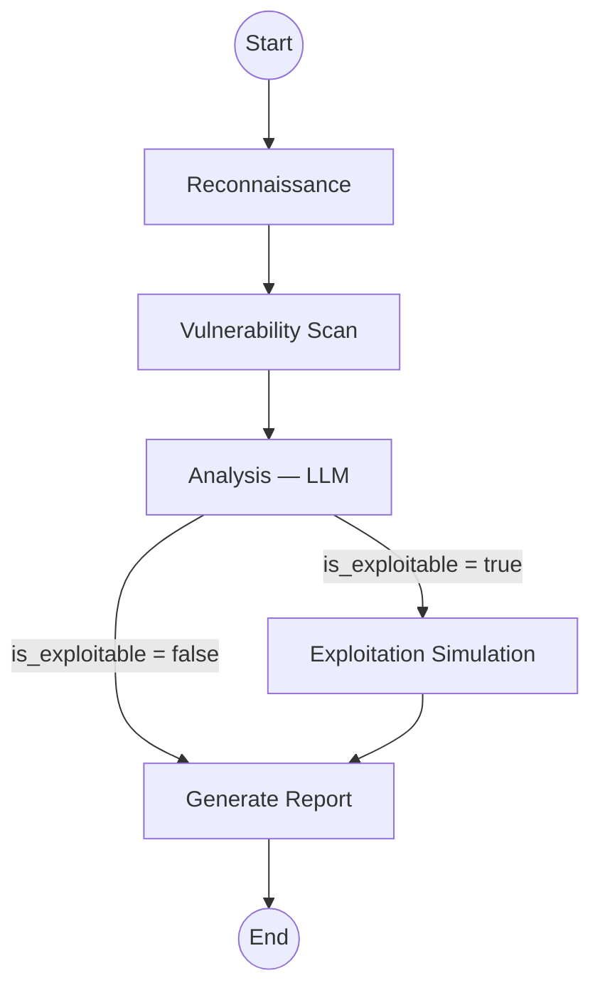
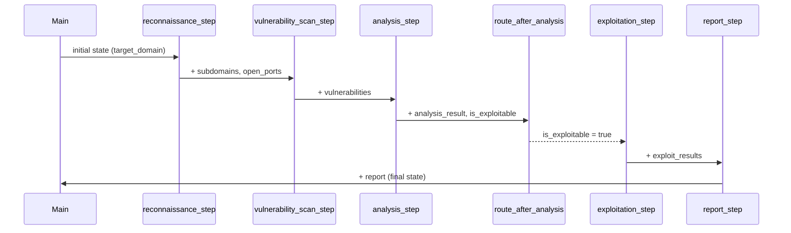

# A Step-by-Step Tutorial of Attack Surface Management / Auto Pen Test with LangGraph

This tutorial walks through a **penetration-testing workflow** built with [LangGraph](https://langchain-ai.github.io/langgraph/).  The workflow models an automated attack surface management (ASM) pipeline as a directed graph whose nodes represent discrete stages of a pentest: reconnaissance, vulnerability scanning, LLM-powered analysis, optional exploitation simulation, and report generation.

Everything runs against **placeholder tool functions** that simulate real security scanners (subfinder, nmap, nuclei), so the example is completely safe to execute without touching any live network.

---

## Table of Contents

1. [What is LangGraph?](#what-is-langgraph)
2. [Architecture Overview](#architecture-overview)
3. [File-by-File Walkthrough](#file-by-file-walkthrough)
   - [State — `pentest_graph_state.py`](#state--pentest_graph_statepy)
   - [Nodes — `pentest_graph_nodes.py`](#nodes--pentest_graph_nodespy)
   - [Router — `pentest_graph_router.py`](#router--pentest_graph_routerpy)
   - [Main — `main.py`](#main--mainpy)
4. [How the Graph Executes](#how-the-graph-executes)
5. [Key LangGraph Concepts Demonstrated](#key-langgraph-concepts-demonstrated)
6. [Prerequisites](#prerequisites)
7. [Running the Example](#running-the-example)
8. [Customization Ideas](#customization-ideas)
9. [Safety and Ethics](#safety-and-ethics)
10. [References](#references)

---

## What is LangGraph?

LangGraph is a low-level orchestration framework from LangChain for building **stateful, multi-step agent workflows** as directed graphs.  Unlike a simple chain (prompt → LLM → output), a LangGraph application can:

- **Maintain shared state** that every node can read and update.
- **Branch conditionally** — route to different nodes depending on runtime results.
- **Loop** — revisit nodes when iterative refinement is needed.
- **Persist and resume** — checkpoint state for long-running or human-in-the-loop workflows.

In this example we use LangGraph to model a pentesting pipeline where the *output of one stage feeds the next*, and the graph dynamically decides whether an exploitation step is needed based on an LLM's analysis.

---

## Architecture Overview



The graph follows a mostly linear pipeline with one **conditional branch** after the analysis node:

| Path | Condition | What happens |
|---|---|---|
| Analysis → Exploitation → Report | The LLM determines a critical finding is exploitable | A simulated exploitation step runs first, then the report includes proof-of-concept evidence |
| Analysis → Report | No exploitable findings | The report is generated directly |

---

## File-by-File Walkthrough

### State — `pentest_graph_state.py`

The state is a Python `TypedDict` subclass called `AttackSurfaceState`.  It defines every piece of data that flows through the graph.

```python
class AttackSurfaceState(TypedDict):
    target_domain:   str
    subdomains:      Annotated[List[str], add]
    open_ports:      Annotated[dict, merge_dicts]
    vulnerabilities: Annotated[List[dict], add]
    analysis_result: Optional[str]
    is_exploitable:  bool
    exploit_results: Optional[str]
    report:          Optional[str]
    workflow_log:    Annotated[List[str], add]
```

**Why `Annotated` reducers matter:**  When a node returns `{"workflow_log": ["Recon complete"]}`, LangGraph needs to know *how* to combine that with the existing `workflow_log` list.  Without a reducer it would **overwrite** the list — losing entries from prior nodes.  By annotating the field with `operator.add`, LangGraph automatically **appends** new items instead.  The same applies to `subdomains`, `vulnerabilities`, and the custom `merge_dicts` reducer for `open_ports`.

### Nodes — `pentest_graph_nodes.py`

Each exported function is a graph node.  A node receives the current `AttackSurfaceState` and returns a `dict` with the keys it wants to update.

#### Placeholder tool functions

These simulate real security tools so the demo runs without network access:

| Function | Simulates | Returns |
|---|---|---|
| `run_subfinder(domain)` | [subfinder](https://github.com/projectdiscovery/subfinder) | `["api.example.com", "blog.example.com", "test.example.com"]` |
| `run_nmap(host)` | [nmap](https://nmap.org/) | `[80, 443]` or `[80, 443, 8080]` for `api.*` hosts |
| `run_nuclei(host, ports)` | [nuclei](https://github.com/projectdiscovery/nuclei) | A critical Log4Shell finding for `api.*:8080`, empty otherwise |

#### Node functions

| Node | Purpose |
|---|---|
| `reconnaissance_step` | Calls `run_subfinder` and `run_nmap` for every discovered host.  Populates `subdomains` and `open_ports`. |
| `vulnerability_scan_step` | Iterates over `open_ports` and calls `run_nuclei` for each host.  Populates `vulnerabilities`. |
| `analysis_step` | Sends the vulnerability findings to an LLM using **`with_structured_output`** bound to a Pydantic model (`VulnerabilityAnalysis`).  The LLM returns a validated object with `analysis` (text) and `is_exploitable` (bool). |
| `exploitation_step` | Simulates a controlled proof-of-concept against critical findings.  Records results in `exploit_results`. |
| `report_step` | Assembles a markdown report from every populated field in the state. |

**Structured output vs. JSON parsing:** The analysis node uses `llm.with_structured_output(VulnerabilityAnalysis)` instead of a raw `JsonOutputParser`.  This has two advantages:

1. **Type safety** — the response is a validated Pydantic object, not a raw dict.
2. **Reliability** — OpenAI's function-calling / structured-output API constrains the model to produce exactly the declared schema, reducing parse failures.

### Router — `pentest_graph_router.py`

The router is a plain function that receives the state and returns a **string key** that LangGraph maps to the next node:

```python
def route_after_analysis(state: AttackSurfaceState) -> str:
    if state.get("is_exploitable"):
        return "exploitation"      # → exploitation node
    return "generate_report"       # → report node
```

This is registered in `main.py` via `add_conditional_edges`, along with a mapping dict that translates string keys to node names.

### Main — `main.py`

This is the entry point that wires everything together:

1. **Create a `StateGraph`** parameterised with `AttackSurfaceState`.
2. **Register nodes** — each string key maps to a node function.
3. **Define edges**:
   - *Linear edges*: `reconnaissance → vulnerability_scan → analysis`.
   - *Conditional edge*: after `analysis`, call `route_after_analysis` to pick the next node.
   - `exploitation → generate_report` (linear — exploitation always leads to the report).
   - `generate_report → END`.
4. **Compile** the graph into a runnable application.
5. **Invoke** with an initial state dict and print the results.

---

## How the Graph Executes

Below is the step-by-step execution trace for the default `example.com` target:

```
1. reconnaissance_step
   ├── subfinder → ["api.example.com", "blog.example.com", "test.example.com"]
   └── nmap on each host → open_ports populated

2. vulnerability_scan_step
   └── nuclei on each host:port → Log4Shell finding on api.example.com:8080

3. analysis_step
   └── LLM (with_structured_output) → is_exploitable = True

4. route_after_analysis
   └── "exploitation"  (conditional branch taken)

5. exploitation_step
   └── Simulated PoC against Log4Shell on api.example.com

6. report_step
   └── Final markdown report compiled from all state fields
```



---

## Key LangGraph Concepts Demonstrated

| Concept | Where it appears | Why it matters |
|---|---|---|
| **StateGraph** | `main.py` — `StateGraph(AttackSurfaceState)` | Typed, shared state is the backbone of every LangGraph app |
| **Annotated reducers** | `pentest_graph_state.py` — `Annotated[List[str], add]` | Nodes can independently append to the same list without manual merging |
| **Nodes** | `pentest_graph_nodes.py` — five step functions | Each node is a pure function: `state in → partial state update out` |
| **Linear edges** | `main.py` — `add_edge("recon", "vuln_scan")` | Guarantee execution order for dependent stages |
| **Conditional edges** | `main.py` — `add_conditional_edges(...)` | Enable dynamic branching based on runtime state |
| **Router function** | `pentest_graph_router.py` — `route_after_analysis` | Clean separation of routing logic from node logic |
| **Structured LLM output** | `pentest_graph_nodes.py` — `llm.with_structured_output(...)` | Type-safe, validated responses from the LLM |
| **Entry point / END** | `main.py` — `set_entry_point`, `END` | Define where the graph starts and terminates |

---

## Prerequisites

- Python 3.10+
- An OpenAI API key (used by the `analysis_step` node)

Install dependencies from the repository root:

```bash
pip install langchain langchain-openai langgraph python-dotenv pydantic
```

Set your API key:

```bash
# Option A: export directly
export OPENAI_API_KEY="your-key-here"

# Option B: use a .env file (loaded automatically by the scripts)
echo 'OPENAI_API_KEY=your-key-here' > .env
```

> The placeholder tools do **not** perform real scanning.  Only the LLM call in `analysis_step` requires network access and a valid API key.  If you want to run the example fully offline, you can replace `analysis_step` with a hard-coded return for testing.

---

## Running the Example

```bash
# From the repository root
python part5_agents_and_tools/asm_example/main.py

# Or from this directory
cd part5_agents_and_tools/asm_example
python main.py
```

**Expected output:**

1. Tool invocation logs (`--- TOOL: Running subfinder on example.com ---`, etc.).
2. A router decision (`--- ROUTER: Exploitable vulnerability found → exploitation ---`).
3. A formatted **Penetration Test Report** with subdomains, open ports, vulnerabilities, analysis, and exploitation results.
4. A **Workflow Log** listing every step that executed.

---

## Customization Ideas

| What to change | How |
|---|---|
| **Target domain** | Edit `initial_state["target_domain"]` in `main.py` |
| **Add realistic tools** | Replace `run_subfinder` / `run_nmap` / `run_nuclei` in `pentest_graph_nodes.py` with wrappers around the real CLI tools.  Always ensure you have written authorisation before scanning any external system. |
| **Add new graph branches** | Add a new node function, register it in `main.py`, and update `route_after_analysis` (or add another conditional edge) to route to it |
| **Change the LLM** | Update the `ChatOpenAI(model=...)` call in `pentest_graph_nodes.py`, or swap to `ChatAnthropic` / another provider |
| **Add human-in-the-loop** | LangGraph supports `interrupt_before` and `interrupt_after` on nodes — add an interrupt before the exploitation node so a human must approve before proceeding |
| **Persist state** | Pass a `checkpointer` (e.g. `SqliteSaver`) to `workflow.compile(checkpointer=...)` to persist state across runs |

---

## Safety and Ethics

This project is for **educational purposes only**.  The included scanning functions are placeholders that do not touch any real network.

If you integrate real security tools:

- Only test against systems you **own** or have **explicit written permission** to assess.
- Follow all applicable laws, regulations, and responsible disclosure practices.
- Never use automated exploitation without clearly defined rules of engagement.

---

## References

- [LangGraph Documentation](https://langchain-ai.github.io/langgraph/)
- [LangGraph How-To: State Reducers](https://langchain-ai.github.io/langgraph/how-tos/state-reducers/)
- [LangChain Structured Output](https://python.langchain.com/docs/how_to/structured_output/)
- [ReAct: Synergizing Reasoning and Acting in Language Models (Yao et al., 2022)](https://react-lm.github.io/)
- [subfinder — Subdomain Discovery Tool](https://github.com/projectdiscovery/subfinder)
- [nmap — Network Exploration Tool](https://nmap.org/)
- [nuclei — Vulnerability Scanner](https://github.com/projectdiscovery/nuclei)
