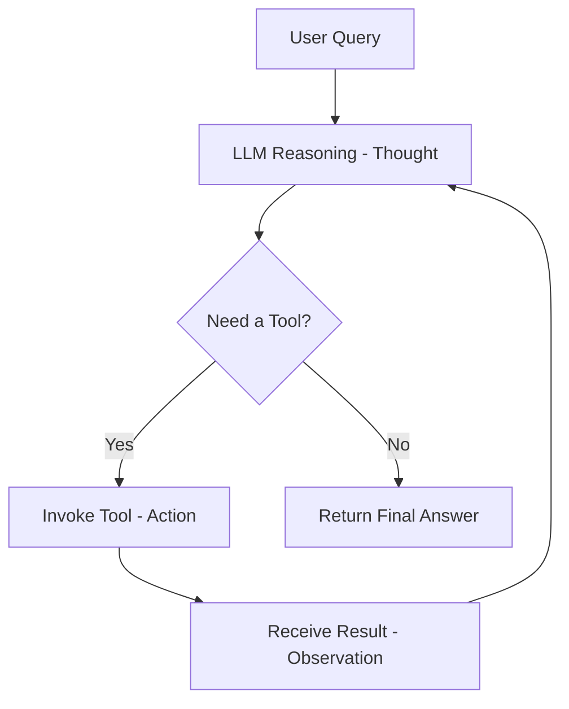
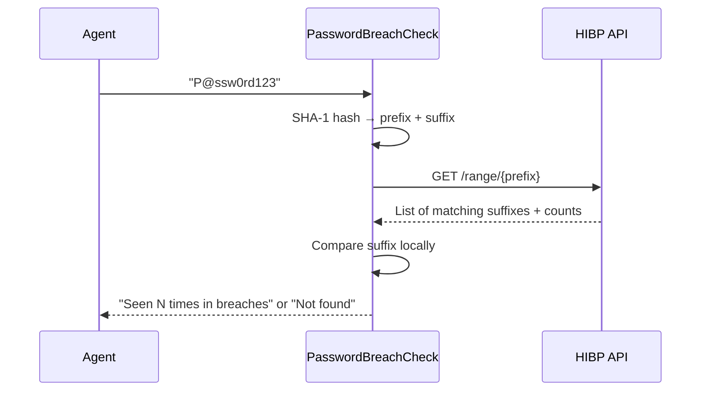
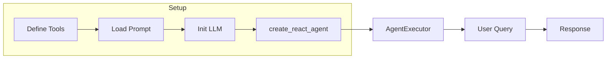

# Building Cybersecurity Agents with LangChain Tools

This document explains the core concepts behind `basic_agent_and_tools.py` and `basic_agent_and_tools_scanner.py` -- two scripts that demonstrate how to build LLM-powered agents capable of invoking external cybersecurity tools using the LangChain ReAct framework.

## The ReAct Framework

ReAct (**Re**asoning + **Act**ing) is a prompting paradigm introduced by [Yao et al. (2022)](https://react-lm.github.io/) that allows a large language model to solve complex tasks by interleaving **reasoning** steps with **action** steps in a loop. Instead of generating a single response and stopping, a ReAct agent iterates until it has a verified, grounded answer.

The loop follows three phases:

1. **Thought** -- the model reasons about the problem and decides what to do next.
2. **Action** -- the model invokes an external tool (API call, scanner, database query, etc.).
3. **Observation** -- the tool's output is fed back to the model, which uses it to decide whether more steps are needed or a final answer can be produced.

This cycle reduces hallucinations by grounding the model in real data, improves interpretability through an auditable trace of intermediate steps, and enables error recovery since the model can revise its plan when an action fails.



## Key LangChain Components

Both scripts rely on a small set of LangChain building blocks.

### `Tool` and `StructuredTool`

A **Tool** wraps a plain Python function so the agent can call it. Each tool has:

| Attribute | Purpose |
|---|---|
| `name` | Unique identifier the agent uses to select the tool |
| `func` | The Python callable that executes the tool's logic |
| `description` | Natural-language explanation that tells the agent *when* to use the tool |

`Tool` accepts a single string argument. When a tool needs multiple typed arguments, LangChain provides **`StructuredTool`**, which pairs the function with a [Pydantic](https://docs.pydantic.dev/) `args_schema` so the agent can pass structured, validated input.

### `create_react_agent`

A factory function that wires together an LLM, a list of tools, and a ReAct prompt template into an agent that follows the Thought → Action → Observation loop described above.

### `AgentExecutor`

The runtime that drives the agent. It repeatedly invokes the agent, routes tool calls to the correct function, collects observations, and returns the final answer. Setting `verbose=True` prints every intermediate step, which is invaluable for debugging and learning.

### ReAct Prompt Template

Both scripts pull the community prompt `hwchase17/react` from [LangSmith Hub](https://smith.langchain.com/hub/hwchase17/react). This template instructs the LLM to structure its output as `Thought: ... Action: ... Action Input: ... Observation: ...` so `AgentExecutor` can parse and dispatch tool calls automatically.

## Script 1 -- `basic_agent_and_tools.py`

This script creates an agent with a single cybersecurity tool: **PasswordBreachCheck**.

### How the tool works

The `check_password_breach` function queries the [Have I Been Pwned Passwords API](https://haveibeenpwned.com/API/v3#PwnedPasswords) using the **k-anonymity** model:

1. Hash the candidate password with SHA-1.
2. Send only the **first 5 hex characters** of the hash to the API -- the full password (or its full hash) is never transmitted.
3. The API returns all known hash suffixes that share that prefix.
4. The tool checks locally whether the remaining suffix appears in the response and reports how many times the password has been seen in data breaches.



### Execution flow

```text
User: "Is the password 'P@ssw0rd123' safe to use?"
  → Thought: I should check if this password has been leaked.
  → Action: PasswordBreachCheck
  → Action Input: P@ssw0rd123
  → Observation: WARNING: This password has been seen X time(s)...
  → Final Answer: This password is compromised and should not be used.
```

## Script 2 -- `basic_agent_and_tools_scanner.py`

This script gives the agent **two** tools: a simple time utility and a network scanner.

### The Scanner tool

The `scanner` function wraps the [python-nmap](https://pypi.org/project/python-nmap/) library to perform host discovery on a given IP address or CIDR range. Because the function requires a typed argument (`ip_address`), it uses `StructuredTool` with a Pydantic model:

```python
class ScannerInput(BaseModel):
    ip_address: str = Field(..., description="The IP address or range to scan")
```

This schema tells the agent exactly what input the tool expects and validates it before execution.

### Tool vs. StructuredTool comparison

| Feature | `Tool` (Script 1) | `StructuredTool` (Script 2) |
|---|---|---|
| Input type | Single string | Pydantic model with typed fields |
| Validation | None built-in | Automatic via Pydantic |
| Use case | Simple, single-argument tools | Tools that need multiple or complex arguments |

### Execution flow

```text
User: "Scan the IP address 192.168.25.48"
  → Thought: I need to scan this IP address.
  → Action: Scanner
  → Action Input: {"ip_address": "192.168.25.48"}
  → Observation: ['192.168.25.48']
  → Final Answer: The scan discovered host 192.168.25.48 is up.
```

### Security considerations

Network scanning should only be performed against systems you own or have explicit written authorization to test. Unauthorized scanning may violate local laws and regulations. Always follow responsible disclosure practices.

## Putting It All Together

Both scripts follow the same high-level pattern:

1. **Define tools** -- wrap cybersecurity functions (`check_password_breach`, `scanner`) as LangChain `Tool` or `StructuredTool` objects.
2. **Load a ReAct prompt** -- pull the community template that teaches the LLM the Thought/Action/Observation format.
3. **Initialize the LLM** -- create a `ChatOpenAI` instance pointing at the desired model.
4. **Build the agent** -- call `create_react_agent(llm, tools, prompt)`.
5. **Run via AgentExecutor** -- invoke with a natural-language query and let the loop drive tool selection and reasoning.



This pattern is extensible -- you can add any number of tools (vulnerability scanners, threat-intel lookups, log analyzers) and the agent will reason about which ones to call based on the user's query.

## References

- [ReAct: Synergizing Reasoning and Acting in Language Models (Yao et al., 2022)](https://react-lm.github.io/)
- [LangChain Agents Documentation](https://python.langchain.com/docs/concepts/agents/)
- [LangChain Tools Documentation](https://python.langchain.com/docs/concepts/tools/)
- [Have I Been Pwned -- Pwned Passwords API](https://haveibeenpwned.com/API/v3#PwnedPasswords)
- [python-nmap on PyPI](https://pypi.org/project/python-nmap/)
- [hwchase17/react Prompt on LangSmith Hub](https://smith.langchain.com/hub/hwchase17/react)
