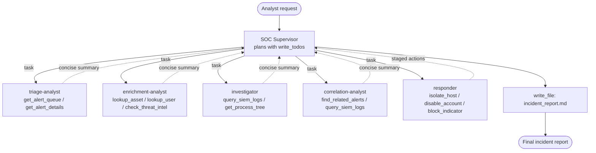

# Building an Autonomous SOC Agent with DeepAgents

This example builds a **Security Operations Center (SOC) analyst agent** using
[`deepagents`](https://docs.langchain.com/oss/python/deepagents/overview) — LangChain's
"agent harness" that ships with built‑in planning, a virtual filesystem, and
sub‑agent spawning on top of the LangGraph runtime.

A single **SOC supervisor** agent coordinates **five specialized subagents** that
map one‑to‑one to the real job of a Tier‑1/Tier‑2 analyst:

| Phase | Subagent | What it does |
|-------|----------|--------------|
| **Triage** | `triage-analyst` | Filters and prioritizes the alert queue, suppressing noise and surfacing what matters. |
| **Enrichment** | `enrichment-analyst` | Pulls context automatically — asset owner, user history, threat‑intel reputation, related data. |
| **Investigation** | `investigator` | Forms and tests hypotheses, queries logs, and reconstructs the incident timeline. |
| **Correlation** | `correlation-analyst` | Links signals across tools into a single coherent story instead of disconnected alerts. |
| **Response** | `responder` | Recommends or **stages** containment — isolate host, disable account, block indicator — *with approval*. |

Everything runs against an **in‑memory, simulated SOC environment** (alerts, assets,
users, threat intel, logs). No real SIEM, EDR, or network is ever touched, so the
example is completely safe to run. Only the LLM calls require network access and an
API key.

---

## Table of Contents

1. [Why DeepAgents for a SOC?](#why-deepagents-for-a-soc)
2. [Architecture](#architecture)
3. [The simulated incident](#the-simulated-incident)
4. [File walkthrough](#file-walkthrough)
5. [Prerequisites](#prerequisites)
6. [Running the example](#running-the-example)
7. [What you'll see](#what-youll-see)
8. [Adding real human‑in‑the‑loop approval](#adding-real-human-in-the-loop-approval)
9. [Customization ideas](#customization-ideas)
10. [Safety and ethics](#safety-and-ethics)
11. [References](#references)

---

## Why DeepAgents for a SOC?

A SOC investigation is a textbook "deep" task: multi‑step, context‑heavy, and full of
large tool outputs (log dumps, alert blobs, threat‑intel records). DeepAgents gives us
three capabilities that fit this perfectly, for free:

- **`write_todos` (planning)** — the supervisor breaks the alert‑to‑incident workflow
  into discrete steps and tracks progress, just like an analyst working a ticket.
- **Virtual filesystem (`write_file` / `read_file`)** — large intermediate results can
  be offloaded to files instead of bloating the context window. The final
  `incident_report.md` is written here.
- **Subagents (`task` tool)** — each phase runs in its **own clean context**. The
  triage subagent can read the whole noisy queue and return *only* a ranked shortlist;
  the supervisor never sees the raw noise. This **context quarantine** is the single
  biggest reason the workflow stays coherent.

This is the key difference from the plain LangGraph examples elsewhere in this repo:
instead of *you* hand‑wiring every node and edge, the supervisor LLM **plans and
delegates dynamically** using the harness's built‑in tools.

## Architecture



The supervisor itself holds **no raw tools** — it only plans and delegates. Each
subagent is given the **minimum tool set** it needs (least privilege + focus) and is
instructed to return a short summary so the supervisor's context stays clean.

## The simulated incident

The mock environment tells one self‑consistent story so the agent has something real to
reason about — a classic phishing → credential theft → lateral movement → C2 chain:

1. `jdoe` (Senior Financial Analyst) opens a malicious `.docm` attachment in Outlook on
   the high‑value finance workstation `WKS-4471`.
2. Outlook spawns an encoded `powershell.exe`, which downloads a payload from
   `185.220.101.47` (a **known‑malicious C2 / Tor exit node** in threat intel).
3. The payload (`update.exe`, a malicious SHA‑256) beacons out over TLS and the host
   begins **SMB lateral movement** to `WKS-2210`.
4. An **impossible‑travel** sign‑in for `jdoe` fires from the same C2 IP.

Two **benign noise alerts** (a Defender definition update and a scheduled vuln scan)
are mixed in so the triage subagent has something to correctly *suppress*.

## File walkthrough

### `soc_agent.py`

| Section | Contents |
|---------|----------|
| **1. Simulated environment** | `ALERT_QUEUE`, `ASSET_INVENTORY`, `USER_DIRECTORY`, `THREAT_INTEL`, `SIEM_LOGS` — the in‑memory dataset. |
| **2. Tools** | Plain Python functions grouped by phase. Docstrings matter — the LLM reads them to decide when to call each tool. They return JSON strings for easy parsing. |
| **3. Subagents** | Five `SubAgent` dictionaries (`name`, `description`, `system_prompt`, `tools`). Descriptions tell the supervisor *when* to delegate; system prompts tell the subagent *how* to work and to stay concise. |
| **4. Supervisor** | `create_deep_agent(...)` with the orchestration prompt and the five subagents. |
| **5. Runner** | Invokes the agent and prints the final response plus the `incident_report.md` from the virtual filesystem. |

The response tools (`isolate_host`, `disable_account`, `block_indicator`) deliberately
**stage** actions and return `PENDING_ANALYST_APPROVAL` — they never execute. This
models the SOC's change‑control / rules‑of‑engagement.

## Prerequisites

- **Python 3.11+** (this script declares `requires-python = ">=3.11"`; the rest of the repo targets 3.13+)
- An **OpenAI API key** (or change `MODEL` to any provider DeepAgents supports)
- [`uv`](https://docs.astral.sh/uv/) (recommended) or `pip` + the `deepagents` package

## Running the example

This script is **self‑contained** via a [PEP 723](https://peps.python.org/pep-0723/)
inline metadata block (it declares its own dependencies). The easiest way to run it is
to let `uv` build a throwaway isolated environment for just this script — **no project
`uv sync` required**. This is especially useful on platforms where the repo's heavier
dependencies (e.g. `torch`) have no compatible wheel.

From the repository root:

```bash
# Provide your API key (or put it in a .env file at the repo root)
export OPENAI_API_KEY="your-key-here"

# Run the SOC agent — uv reads the inline dependencies and isolates the run
uv run part5_agents_and_tools/deepagents_example/soc_agent.py
```

> **Important:** run the file directly (`uv run <script.py>`), **not**
> `uv run python <script.py>`. Passing the file lets `uv` detect the inline metadata
> and build the isolated environment; adding `python` would instead use the shared
> project environment (which may fail to sync on some platforms).

Alternatively, use the shared project environment (if it syncs on your platform):

```bash
uv sync --python python3.13
uv run python part5_agents_and_tools/deepagents_example/soc_agent.py
```

Or with plain pip:

```bash
pip install deepagents langchain-openai python-dotenv
export OPENAI_API_KEY="your-key-here"
python part5_agents_and_tools/deepagents_example/soc_agent.py
```

## What you'll see

1. The supervisor writes a **todo plan** for the five phases.
2. A series of `task(...)` delegations — one per subagent — each returning a concise
   summary.
3. A final, structured **incident report** containing: summary, severity/priority,
   affected assets and users, a timeline, IOCs, correlated alerts, and **staged**
   response actions each marked *PENDING APPROVAL*.

> Tip: LangSmith tracing is **off by default** here — the script disables it
> automatically unless a `LANGSMITH_API_KEY` is set, to avoid noisy `403` upload errors
> for users who haven't configured LangSmith. To watch the supervisor and each subagent
> run separately, set `LANGSMITH_API_KEY` (and optionally `LANGSMITH_TRACING=true`).

## Adding real human‑in‑the‑loop approval

In this example, containment is staged via tool return values. To enforce a true
**pause‑for‑approval** before any response tool runs, DeepAgents supports `interrupt_on`
with a checkpointer. Sketch:

```python
from langgraph.checkpoint.memory import InMemorySaver

responder = {
    "name": "responder",
    # ...
    "tools": [isolate_host, disable_account, block_indicator],
    "interrupt_on": {                 # pause before each containment tool
        "isolate_host": True,
        "disable_account": True,
        "block_indicator": True,
    },
}

agent = create_deep_agent(
    model=MODEL,
    system_prompt=SOC_SUPERVISOR_PROMPT,
    subagents=SUBAGENTS,
    checkpointer=InMemorySaver(),     # required for interrupts/resume
)
```

The graph will then **interrupt** before executing a gated tool, surfacing the proposed
action so a human can approve, edit, or reject it before the agent resumes. See the
DeepAgents [Human‑in‑the‑loop](https://docs.langchain.com/oss/python/deepagents/human-in-the-loop)
guide for the full resume flow.

## Customization ideas

| What to change | How |
|----------------|-----|
| **Connect real tools** | Replace the simulated functions with wrappers around your SIEM (Splunk, Elastic), EDR (CrowdStrike, Defender), and TIP (VirusTotal, MISP) APIs. Keep the docstrings descriptive. |
| **Add an MCP server** | This repo already has a `cyber_mcp_server` (`run_nmap_scan`, `get_cisa_kev_catalog`). Expose those as tools to the `enrichment-analyst`. |
| **Swap the model** | Change `MODEL` to any `provider:model` string, or give a heavyweight model to the `investigator` only via its `model` field. |
| **Structured output** | Give a subagent a `response_format` (Pydantic model) so the supervisor receives parseable JSON instead of free text. |
| **Persist memory** | Add long‑term memory so the agent remembers prior incidents across runs. |

## Safety and ethics

This project is for **educational purposes only**. The SOC environment is entirely
simulated and the response actions are **staged, never executed**.

If you connect real tools:

- Only act on systems you **own** or have **explicit written authorization** to defend.
- Keep containment behind **human approval** and your organization's change‑control.
- Follow all applicable laws, regulations, and incident‑response policies.

## References

- [DeepAgents Overview](https://docs.langchain.com/oss/python/deepagents/overview)
- [DeepAgents Quickstart](https://docs.langchain.com/oss/python/deepagents/quickstart)
- [DeepAgents Subagents](https://docs.langchain.com/oss/python/deepagents/subagents)
- [DeepAgents Human‑in‑the‑loop](https://docs.langchain.com/oss/python/deepagents/human-in-the-loop)
- [LangGraph Documentation](https://langchain-ai.github.io/langgraph/)
- [MITRE ATT&CK](https://attack.mitre.org/)
