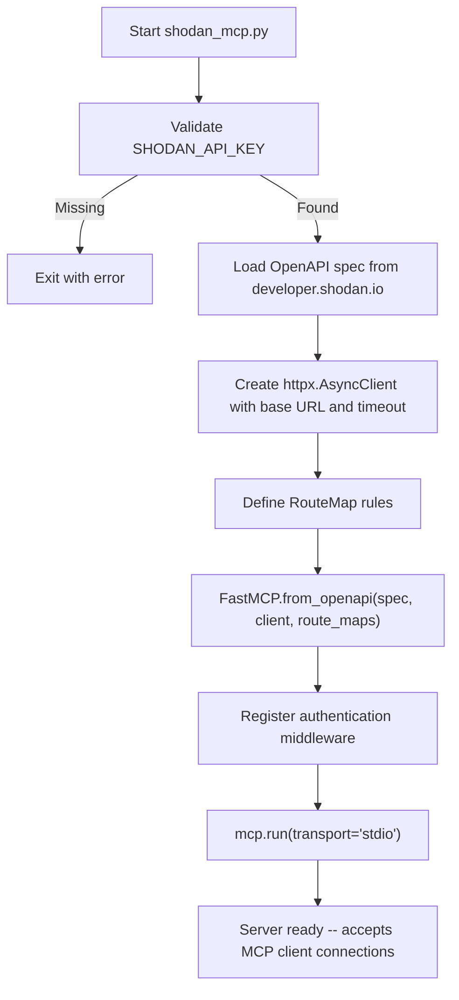
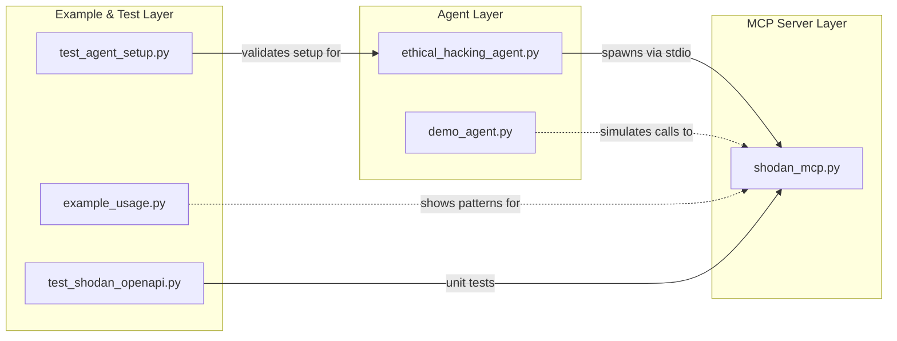

# Shodan MCP Server: Architecture, Usage, and Agent Integration

This guide explains how the Shodan MCP server (`shodan_mcp.py`) works, how the companion agents and scripts in this directory use it, and how to extend it for your own cybersecurity workflows. It is written for learners and practitioners who want to understand the full lifecycle of an MCP-based security tool, from server creation to AI-agent-driven reconnaissance.

## What This Server Does

The Shodan MCP server bridges the Shodan cybersecurity search engine and any AI application that speaks the Model Context Protocol (MCP). Instead of writing individual tool wrappers for every Shodan API endpoint, the server loads Shodan's OpenAPI specification at startup and automatically generates MCP-compatible tools, resources, and resource templates. An AI agent (or any MCP client) can then discover and invoke those capabilities without knowing the underlying REST calls.

## Key Concepts

### Model Context Protocol (MCP)

MCP is an open standard, originally introduced by Anthropic, that provides a uniform interface between AI applications and external services. It follows a client-server architecture with three participants:

- **Host** -- the AI application (Claude Desktop, VS Code, a custom LangGraph agent, etc.) that coordinates connections.
- **Client** -- a per-server adapter inside the host that maintains a dedicated connection to one MCP server.
- **Server** -- a program that exposes capabilities through three primitives: **Tools** (callable operations), **Resources** (read-only data), and **Prompts** (reusable templates).

Communication happens over JSON-RPC, transported via **stdio** (for local servers) or **HTTP + Server-Sent Events** (for remote servers).

### FastMCP and OpenAPI Auto-Generation

FastMCP is a Python framework for building MCP servers. Its `FastMCP.from_openapi()` class method accepts an OpenAPI specification and an HTTP client, then automatically generates MCP primitives for every endpoint in the spec. The mapping follows sensible defaults:

| OpenAPI Endpoint Pattern | Default MCP Primitive |
|---|---|
| `GET` without path parameters | Resource |
| `GET` with path parameters (e.g. `/host/{ip}`) | ResourceTemplate |
| `POST`, `PUT`, `PATCH`, `DELETE` | Tool |

These defaults can be overridden with **RouteMap** objects to better match how an AI agent will use the endpoints.

### Shodan

Shodan is a search engine for Internet-connected devices. Its REST API exposes host search, DNS resolution, on-demand scanning, network alerts, and more. A free API key provides 100 query credits per month; paid plans raise limits and unlock additional endpoints.

## How `shodan_mcp.py` Works

The server's startup sequence has four stages. The diagram below shows the flow from launch to a running MCP server that accepts client connections:



### Stage 1: API Key Validation

`get_api_key()` reads the `SHODAN_API_KEY` environment variable. If it is missing, the server exits with a clear error message and setup instructions. The key is never hardcoded or logged in full; only the first eight characters are printed during startup.

### Stage 2: OpenAPI Specification Loading

`load_openapi_spec()` fetches Shodan's specification from `https://developer.shodan.io/api/openapi.json` using a synchronous `httpx.get` call. This means the server always starts with the latest API surface, including any endpoints Shodan has added since the code was written. If the fetch fails (network issue, HTTP error), a `RuntimeError` is raised and the server exits cleanly.

### Stage 3: Route Mapping

`create_route_maps()` returns a list of `RouteMap` objects that override FastMCP's default endpoint-to-primitive mapping. Each rule matches endpoints by HTTP method and a regex pattern on the path:

| Rule | Pattern | MCP Type | Rationale |
|---|---|---|---|
| Path-parameterized GETs | `.*\{.*\}.*` | ResourceTemplate | Host lookups like `/shodan/host/{ip}` are natural resource templates. |
| Search endpoints | `.*/search.*` | Tool | Agents actively invoke searches; tools are more discoverable than resources. |
| Count endpoints | `.*/count.*` | Tool | Counting results is an active operation, not static data. |
| DNS endpoints | `.*/dns/.*` | Tool | DNS resolution and reverse lookup are active operations. |
| Scan endpoints | `.*/scan.*` | Tool | Starting and querying scans are imperative actions. |
| Account and API info | `.*/account/.*\|.*/api-info.*` | Resource | Account profile and credit info are read-only data. |
| Everything else | `.*` | Resource | Safe default for remaining GET endpoints. |

The rules are evaluated in order; the first match wins.

### Stage 4: Server Construction and Launch

`create_mcp_server()` calls `FastMCP.from_openapi()` with the loaded spec, the `httpx.AsyncClient`, and the route maps. It also registers middleware that injects the Shodan API key as a query parameter (`?key=...`) into every outbound request, so individual tools do not need to handle authentication.

Finally, `mcp.run(transport="stdio")` starts the server. It reads JSON-RPC messages from stdin and writes responses to stdout, which is the standard transport for local MCP servers.

## Agent and Script Inventory

The directory contains several scripts that consume or demonstrate the MCP server. The relationships are:



### `ethical_hacking_agent.py` -- Live ReAct Agent

This is the primary consumer of the MCP server. It builds a fully functional AI agent using three components:

1. **`MultiServerMCPClient`** (from `langchain-mcp-adapters`) -- spawns `shodan_mcp.py` as a child process over stdio and discovers all available tools.
2. **`ChatOpenAI`** (from `langchain-openai`) -- the LLM that reasons about which tools to call and how to interpret results.
3. **`create_react_agent`** (from `langgraph`) -- wires the LLM and tools into a ReAct (Reason + Act) loop: the model thinks, selects a tool, observes the result, and repeats until it has enough information to answer.

The agent runs four predefined scenarios:

| Scenario | What It Does |
|---|---|
| Infrastructure Reconnaissance | Searches for hosts on a target domain, retrieves detailed service information, and produces a security assessment. |
| Vulnerability Assessment | Searches for exposed SSH services in a country, analyzes version distribution, and identifies potentially vulnerable installations. |
| IoT Security Analysis | Finds common IoT devices (e.g. IP cameras), maps their geographic distribution, and checks for default credentials. |
| DNS Intelligence Gathering | Resolves security-related domains, performs reverse lookups, and correlates the results with Shodan host data. |

Each scenario is sent to the agent as a natural-language prompt. The agent autonomously decides which Shodan MCP tools to call (host search, DNS resolve, host info, count, etc.) and in what order.

**Connection flow:**

```python
client = MultiServerMCPClient({
    "shodan_tools": {
        "command": "python",
        "args": [server_path],      # path to shodan_mcp.py
        "transport": "stdio",
    }
})
tools = await client.get_tools()    # auto-discovers all Shodan tools
agent = create_react_agent(llm, tools)
response = await agent.ainvoke({"messages": [{"role": "user", "content": task}]})
```

### `demo_agent.py` -- Offline Simulation

This script mirrors the four scenarios from the ethical hacking agent but uses hardcoded, simulated data instead of live API calls. It requires no API keys or dependencies beyond the standard library, making it useful for:

- Understanding the agent workflow before committing API credits.
- Presenting in environments without Internet access.
- Testing UI or logging changes without touching the real API.

### `example_usage.py` -- Integration Patterns

A cookbook-style script that demonstrates five integration patterns, all with simulated data:

1. **Direct MCP client usage** -- connecting to the server and calling tools directly.
2. **LangGraph integration** -- building a multi-step reconnaissance workflow as a stateful graph.
3. **Threat intelligence gathering** -- running batches of security-focused queries (exposed databases, vulnerable SSH, exposed RDP, IoT devices).
4. **Infrastructure mapping** -- enumerating an organization's assets by service type, geography, and technology stack.
5. **Security monitoring** -- setting up alert rules for new exposed services, vulnerable software, and unauthorized network changes.

Each example is self-contained and annotated with the MCP tool calls that would replace the simulated data in a live deployment.

### `test_shodan_openapi.py` -- Server Unit Tests

Validates the server's internal functions in isolation using `unittest.mock`:

- **API key handling** -- confirms that a missing key raises `ValueError` and a present key is returned correctly.
- **OpenAPI spec loading** -- mocks `httpx.get` and verifies the spec is parsed.
- **Route map creation** -- checks that the expected number of route maps exist and that search patterns are present.
- **Client creation** -- confirms the `httpx.AsyncClient` is created with a base URL.
- **Configuration validation** -- runs `main()` with a missing key and asserts it returns exit code 1.

### `test_agent_setup.py` -- Environment Validation

A pre-flight check that verifies everything the ethical hacking agent needs before it runs:

- Environment variables (`OPENAI_API_KEY`, `SHODAN_API_KEY`) are set.
- Required Python packages are importable.
- Required files (`shodan_mcp.py`, `ethical_hacking_agent.py`, etc.) exist.
- The Shodan API is reachable and the key is valid.

## Running the Server

### Prerequisites

- Python 3.10+
- [uv](https://docs.astral.sh/uv/) for dependency management
- A Shodan API key (free tier: [account.shodan.io/register](https://account.shodan.io/register))

### Install and Start

```bash
# Install core dependencies
uv sync

# Set your API key
export SHODAN_API_KEY="your_key_here"

# Start the MCP server
uv run shodan_mcp.py
```

The server will fetch the OpenAPI spec, generate tools, and begin listening on stdio.

### Running the Ethical Hacking Agent

```bash
# Install agent dependencies (LangGraph, LangChain, OpenAI)
uv sync --extra agent

# Create a .env file from the template
cp env_template.txt .env
# Edit .env and add your OPENAI_API_KEY and SHODAN_API_KEY

# Validate setup
uv run test_agent_setup.py

# Run the agent
uv run ethical_hacking_agent.py
```

### Running Without API Keys

```bash
# Demo agent -- simulated output, no keys required
uv run demo_agent.py

# Example patterns -- simulated output, no keys required
uv run example_usage.py
```

## Extending the Server

### Adding Custom Tools

You can add hand-written tools alongside the auto-generated ones by decorating functions on the `mcp` object after it is created:

```python
mcp = create_mcp_server()

@mcp.tool()
async def summarize_host(ip: str) -> str:
    """Fetch host info from Shodan and return a one-paragraph summary."""
    import httpx
    api_key = get_api_key()
    async with httpx.AsyncClient() as client:
        resp = await client.get(
            f"https://api.shodan.io/shodan/host/{ip}",
            params={"key": api_key}
        )
        data = resp.json()
    ports = data.get("ports", [])
    org = data.get("org", "Unknown")
    return f"{ip} belongs to {org} and exposes ports {ports}."
```

### Connecting a Different LLM

The ethical hacking agent uses OpenAI, but any LangChain-compatible chat model works. Swap `ChatOpenAI` for `ChatAnthropic`, `ChatOllama`, or another provider:

```python
from langchain_anthropic import ChatAnthropic

llm = ChatAnthropic(model="claude-sonnet-4-20250514", temperature=0.1)
agent = create_react_agent(llm, tools)
```

### Using HTTP+SSE Transport

For remote deployments, change the transport from stdio to SSE:

```python
mcp.run(transport="sse", host="0.0.0.0", port=8000)
```

Clients then connect over HTTP instead of spawning a child process.

## Security Considerations

- **API key management**: The server reads the key from an environment variable and never writes it to disk or logs it in full. For production use, consider a secrets manager or vault.
- **Rate limiting**: Shodan enforces per-key rate limits and query credits. The count endpoints (`/shodan/host/count`) do not consume query credits and should be preferred for exploratory work.
- **Authorization**: Always ensure you have explicit permission to scan or query target systems. The scenarios in this repository are designed for educational use against public data.
- **Transport security**: The stdio transport is local-only. If you switch to SSE for remote access, place the server behind TLS and authenticate incoming MCP clients.

## References

- [Model Context Protocol -- Architecture Overview](https://modelcontextprotocol.io/docs/learn/architecture)
- [FastMCP -- OpenAPI Integration](https://gofastmcp.com/v2/integrations/openapi)
- [FastMCP -- `fastmcp.server.openapi` Reference](https://gofastmcp.com/python-sdk/fastmcp-server-openapi)
- [Shodan Developer API Documentation](https://developer.shodan.io/api)
- [Shodan Search Query Fundamentals](https://help.shodan.io/the-basics/search-query-fundamentals)
- [LangGraph Documentation](https://langchain-ai.github.io/langgraph/)
- [langchain-mcp-adapters](https://github.com/langchain-ai/langchain-mcp-adapters)
